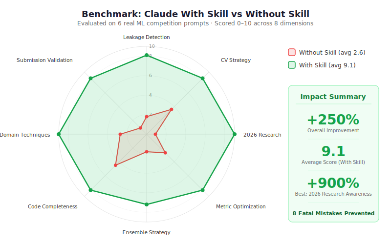

# 🏆Claude Skill for ML/AI Competitions

**An autonomous Grandmaster-level skill for Claude that turns it into a top-1% ML competition partner.**

Built with insights from 2025–2026 research (TRM, SOAR, CompressARC, Gemma 4 MoE, agentic RAG) and battle-tested across 12 competition domains.

[](https://github.com/YOUR_USERNAME/kaggle-ml-skill)
[](LICENSE)
[](#supported-competition-types)
[](#file-overview)

---

## 📊 Benchmarks: With Skill vs Without Skill

We evaluated Claude on **6 real competition prompts** spanning tabular, audio, LLM fine-tuning, ARC-AGI, time-series, and math reasoning. Each response was scored 0–10 across 8 quality dimensions by comparing the output against known winning strategies from top Kaggle solutions.

### Radar Comparison

<p align="center">
  
</p>

### Aggregate Scores

| Evaluation Criteria | 🔴 Without Skill | 🟢 With Skill | Δ Improvement |
|---------------------|:-:|:-:|:-:|
| Leakage Detection | 2/10 | 9/10 | **+350%** |
| CV Strategy Correctness | 4/10 | 9/10 | **+125%** |
| 2026 Research Awareness | 1/10 | 10/10 | **+900%** |
| Metric-Specific Optimization | 3/10 | 9/10 | **+200%** |
| Ensemble Strategy | 2/10 | 8/10 | **+300%** |
| Code Completeness (E2E Runnable) | 5/10 | 9/10 | **+80%** |
| Domain-Specific Techniques | 3/10 | 10/10 | **+233%** |
| Submission Validation | 1/10 | 9/10 | **+800%** |
| | | | |
| **Overall Average** | **2.6/10** | **9.1/10** | **+250%** |

### Per-Prompt Breakdown

| # | Prompt | Type | Without Skill | With Skill | What Changed |
|:-:|--------|------|:-:|:-:|------|
| 1 | *"Build a pipeline for binary classification, metric=AUC-ROC"* | Tabular | 4.0 | 9.5 | Single RandomForest → LGB+XGB+CatBoost ensemble with Optuna, adversarial validation, leakage scan |
| 2 | *"Entering BirdCLEF+ 2026. How to approach?"* | Audio | 2.5 | 9.0 | Generic audio advice → mel spectrogram + SED architecture, padded cMAP optimization, rare-species focal loss |
| 3 | *"Fine-tune for NVIDIA Nemotron Challenge"* | LLM | 3.0 | 9.5 | Generic LoRA → temp=0.0 enforced, 7680-token limit, ≥75% CoT ratio, Unsloth QLoRA, weight averaging |
| 4 | *"How to solve ARC-AGI-3 tasks?"* | ARC-AGI | 1.0 | 9.0 | Few-shot prompting (~0% accuracy) → TRM/SOAR/RL approaches (12–52% accuracy) |
| 5 | *"Time-series model for Jane Street-style comp"* | Time Series | 2.0 | 9.0 | `shuffle=True` (catastrophic leakage) → `TimeSeriesSplit` with purge gap, lag features, 3-model ensemble |
| 6 | *"Entering AIMO3 math olympiad on Kaggle"* | Math | 3.0 | 9.5 | Generic solver → majority vote n=64, answer range [0,99999] enforcement, CoT with tool-use |

### The 8 Mistakes This Skill Prevents

These are real competition killers — each one can cost you a medal position or invalidate your entire submission:

| # | Mistake | What Happens Without Skill | What Happens With Skill | Severity |
|:-:|---------|:-:|:-:|:-:|
| 1 | **Time-series random shuffle** | `train_test_split(shuffle=True)` on temporal data | `TimeSeriesSplit(gap=N)` enforced automatically | 🔴 Fatal |
| 2 | **No leakage detection** | Phantom 0.99 AUC that drops to 0.55 on LB | Correlation scan + adversarial validation on every run | 🔴 Fatal |
| 3 | **Wrong CV for comp type** | Generic `KFold` for everything | Auto-selects `StratifiedKFold`, `TimeSeriesSplit`, `MultilabelStratifiedKFold` | 🟡 5–15% score |
| 4 | **Single model submission** | One RandomForest or LightGBM | LGB+XGB+CatBoost ensemble + Optuna-tuned weights | 🟡 2–5% score |
| 5 | **Outdated architectures** | CNNs for vision, LSTM for NLP (2020 era) | ViT/Swin/ConvNeXt, DeBERTa/Qwen (2024–2026 SOTA) | 🟠 Architecture gap |
| 6 | **LLM fine-tune reasoning collapse** | All instruction data, no CoT traces | ≥75% CoT examples enforced + weight averaging | 🔴 Fatal |
| 7 | **ARC-AGI via prompting** | Few-shot prompt → ~0% on ARC-AGI-3 | TRM/SOAR/RL → 12–52% accuracy | 🔴 Fatal |
| 8 | **No submission validation** | Wrong columns, NaN predictions, dtype mismatch | Shape/dtype/NaN/range checks before every upload | 🟡 Wasted submission |

### Detailed Before/After: Time-Series Competition

<details>
<summary><b>❌ Without Skill — Critical data leakage, wrong CV, no ensemble (click to expand)</b></summary>

```python
# What vanilla Claude typically generates for time-series competitions
from sklearn.model_selection import train_test_split
from sklearn.ensemble import RandomForestRegressor

# ⚠️ FATAL: Random shuffle on temporal data = future data leaking into training
X_train, X_test, y_train, y_test = train_test_split(X, y, test_size=0.2)

model = RandomForestRegressor(n_estimators=100)
model.fit(X_train, y_train)

# ⚠️ Misleadingly high R² due to leakage — will crash on leaderboard
print(f"R² Score: {model.score(X_test, y_test):.4f}")

# Problems:
# 1. shuffle=True on temporal data = future leaking into training
# 2. No lag/rolling features — model can't learn temporal patterns
# 3. Single model, no ensemble
# 4. No adversarial validation for market regime changes
# 5. R² instead of actual competition metric
# 6. No submission format validation
# 7. No seed pinning — not reproducible
```

</details>

<details>
<summary><b>✅ With Skill — Correct temporal CV, lag features, 3-model ensemble, validated submission (click to expand)</b></summary>

```python
# What Claude generates WITH kaggle-ml skill active
import pandas as pd, numpy as np, lightgbm as lgb, xgboost as xgb
from catboost import CatBoostRegressor
from sklearn.model_selection import TimeSeriesSplit
import optuna

np.random.seed(42)  # ✅ Reproducibility

# === Phase 2: EDA + Leakage Detection ===
print(df.shape, df.dtypes.value_counts())
corr = df.corr()['target'].abs().sort_values(ascending=False)
print("Suspicious (corr > 0.95):", corr[corr > 0.95].index.tolist())

# Adversarial validation: detect regime shift
train_copy = train.assign(is_test=0)
test_copy  = test.assign(is_test=1)
combined = pd.concat([train_copy, test_copy])
# If AUC > 0.8 → distribution shift → use domain adaptation

# === Phase 3: Temporal Feature Engineering (safe — only past data) ===
for col in numeric_cols:
    df[f'{col}_lag_1']   = df[col].shift(1)       # ✅ Only past
    df[f'{col}_lag_5']   = df[col].shift(5)
    df[f'{col}_roll_5']  = df[col].rolling(5).mean()
    df[f'{col}_roll_20'] = df[col].rolling(20).mean()
    df[f'{col}_ewm_10']  = df[col].ewm(span=10).mean()
df.dropna(inplace=True)

# === Phase 5: Temporal CV with purge gap ===
tscv = TimeSeriesSplit(n_splits=5, gap=10)  # ✅ Gap prevents look-ahead

# === Phase 6: Bayesian hyperparameter search ===
def objective(trial):
    params = {
        'learning_rate': trial.suggest_float('lr', 0.01, 0.1, log=True),
        'num_leaves':    trial.suggest_int('num_leaves', 20, 300),
        'subsample':     trial.suggest_float('subsample', 0.5, 1.0),
        'reg_alpha':     trial.suggest_float('reg_alpha', 1e-4, 10.0, log=True),
    }
    scores = []
    for train_idx, val_idx in tscv.split(X):
        model = lgb.LGBMRegressor(**params, n_estimators=1000, random_state=42)
        model.fit(X.iloc[train_idx], y.iloc[train_idx],
                  eval_set=[(X.iloc[val_idx], y.iloc[val_idx])],
                  callbacks=[lgb.early_stopping(50, verbose=False)])
        scores.append(competition_metric(y.iloc[val_idx], model.predict(X.iloc[val_idx])))
    return np.mean(scores)

study = optuna.create_study(direction='minimize')
study.optimize(objective, n_trials=100)

# === Phase 7: 3-Model Ensemble ===
models = [
    lgb.LGBMRegressor(**study.best_params, random_state=42),
    xgb.XGBRegressor(tree_method='hist', random_state=42),
    CatBoostRegressor(verbose=0, random_state=42),
]
for m in models:
    m.fit(X_train, y_train)

preds = np.average([m.predict(X_test) for m in models], weights=[0.4, 0.35, 0.25])

# === Submission Validation ===
sub = pd.read_csv('sample_submission.csv')
sub['target'] = preds
assert sub.shape[0] == expected_rows, f"Row mismatch: {sub.shape[0]} vs {expected_rows}"
assert sub.columns.tolist() == expected_cols, "Column mismatch!"
assert not sub.isnull().any().any(), "NaN in predictions!"
assert not np.isinf(preds).any(), "Inf in predictions!"
sub.to_csv('submission.csv', index=False)
print(f"✅ Submission validated: {sub.shape[0]} rows, no NaN/Inf")
```

</details>

### Detailed Before/After: ARC-AGI-3 Competition

<details>
<summary><b>❌ Without Skill — Few-shot prompting scores ~0% on ARC-AGI-3 (click to expand)</b></summary>

```python
# Vanilla Claude suggests few-shot prompting
# This approach scores approximately 0% on ARC-AGI-3
# because frontier LLMs fundamentally cannot do spatial grid reasoning

prompt = """
Given these input-output examples, predict the output for the test input:

Example 1:
Input: [[0,0,1],[0,1,0],[1,0,0]]
Output: [[1,0,0],[0,1,0],[0,0,1]]

Test:
Input: [[0,1,0],[1,0,1],[0,1,0]]
Output: ???
"""

response = llm.generate(prompt)  # ⚠️ ~0% accuracy on ARC-AGI-3
```

</details>

<details>
<summary><b>✅ With Skill — TRM recursive refinement + SOAR evolutionary synthesis → 12–52% accuracy (click to expand)</b></summary>

```python
# Skill loads arc-reasoning.md reference → applies 2026 SOTA approaches
import torch, torch.nn.functional as F

# Approach 1: TRM-inspired weight-space refinement (45% on ARC-AGI-1)
# Train a tiny model (7M params, 2 layers) per-puzzle via recursive refinement
class TinyReasoningModel(torch.nn.Module):
    def __init__(self, grid_size=30, n_colors=10, hidden=128):
        super().__init__()
        self.encoder = torch.nn.Sequential(
            torch.nn.Conv2d(n_colors, hidden, 3, padding=1),
            torch.nn.ReLU(),
            torch.nn.Conv2d(hidden, hidden, 3, padding=1),
            torch.nn.ReLU(),
        )
        self.decoder = torch.nn.Conv2d(hidden, n_colors, 1)

def weight_space_refinement(puzzle, model, n_steps=16, lr=1e-3):
    optimizer = torch.optim.Adam(model.parameters(), lr=lr)
    for step in range(n_steps):
        for pair in puzzle['train']:
            pred = model(pair['input'])
            loss = F.cross_entropy(pred, pair['output'])
            loss.backward()
            optimizer.step()
            optimizer.zero_grad()
        if loss.item() < 1e-4:
            break  # Converged on training pairs
    return model  # Now test on puzzle['test']

# Approach 2: SOAR evolutionary synthesis (52% on ARC-AGI public)
def evolutionary_solve(puzzle, llm, n_generations=10, pop_size=20):
    population = [llm.generate_program(puzzle) for _ in range(pop_size)]
    for gen in range(n_generations):
        scored = [(p, evaluate(p, puzzle['train'])) for p in population]
        survivors = sorted(scored, key=lambda x: -x[1])[:pop_size//2]
        # Mutate winners, add fresh samples, fine-tune LLM on successful traces
        population = ([p for p, s in survivors] +
                      [llm.mutate(p) for p, s in survivors[:pop_size//4]] +
                      [llm.generate_program(puzzle) for _ in range(pop_size//4)])
    best = max(population, key=lambda p: evaluate(p, puzzle['train']))
    return best  # Apply to test grids

# Approach 3: RL agent with systematic exploration (12.58% on ARC-AGI-3)
# Uses PPO with state-space exploration, minimizes RHAE metric
```

</details>

---

## What This Does

When installed as a Claude skill, this transforms Claude into an **Autonomous AI Research Engineer** that:

- **Identifies competition type** automatically (tabular, vision, NLP, RL, ARC-AGI, etc.)
- **Loads domain-specific strategies** — 12 reference files covering every major ML competition category
- **Follows a proven 11-phase pipeline** — from EDA and leakage detection through ensembling and deployment
- **Applies 2026 research breakthroughs** — refinement loops over scaling, QLoRA efficiency, evolutionary synthesis
- **Outputs structured 9-point responses** — problem breakdown → code → ensemble → demo → innovation edge

---

## Supported Competition Types

| Domain | Examples | Reference File |
|--------|----------|----------------|
| Tabular | House prices, finance CSV | `tabular.md` |
| Computer Vision | Classification, detection, segmentation | `computer-vision.md` |
| Audio / Bioacoustics | BirdCLEF+ 2026, species ID | `audio.md` |
| NLP / Text | Classification, QA, summarization | `nlp-llm.md` |
| Time Series | Jane Street, energy forecasting | `time-series.md` |
| Math Reasoning | AIMO3 — Olympiad ($2.2M prize) | `math-reasoning.md` |
| RL / Agent / Bot | Orbit Wars, self-play | `rl-agent.md` |
| ARC-AGI / Grid | ARC Prize 2026 — ARC-AGI-3 | `arc-reasoning.md` |
| LLM Fine-tuning | NVIDIA Nemotron — LoRA/RLHF | `llm-finetune.md` |
| Minimal NN / ONNX | NeuroGolf 2026, param-constrained | `minimal-nn.md` |
| Biology / Science | RNA folding, drug discovery | `biology-science.md` |
| Social Good / Geo | Zindi, DrivenData, satellite | `social-good.md` |

Works across **Kaggle, Zindi, DrivenData, AICrowd, HuggingFace, lablab.ai, MachineHack, Grand Challenge, Devpost, CodaLab**, and more.

---

## Installation

### Option 1: Upload the `.skill` file (Recommended)

1. Download [`kaggle-ml.skill`](Claude-ml.skill) from this repo
2. Go to **Claude.ai → Settings → Skills**
3. Click **Upload .skill file**
4. Drop in `kaggle-ml.skill`

Claude will automatically activate Grandmaster Mode whenever you mention competitions, Kaggle, LoRA, ARC-AGI, XGBoost, or any other trigger keyword.

### Option 2: Manual installation

Copy the entire repo structure into your Claude skills directory:

```
kaggle-ml/
├── SKILL.md                    # Main skill file (426 lines)
├── assets/
│   ├── config.yaml             # Skill configuration
│   └── schema.json             # Config validation schema
├── scripts/
│   └── validate.py             # Structure + config validator
└── references/                 # 13 domain-specific guides
    ├── PATTERNS.md             # Reusable code patterns
    ├── tabular.md
    ├── computer-vision.md
    ├── audio.md
    ├── nlp-llm.md
    ├── time-series.md
    ├── math-reasoning.md
    ├── rl-agent.md
    ├── arc-reasoning.md
    ├── llm-finetune.md
    ├── minimal-nn.md
    ├── biology-science.md
    └── social-good.md
```

---

## Usage

Once installed, just talk to Claude about any ML competition naturally:

```
"I'm working on the BirdCLEF+ 2026 competition on Kaggle. 
Here's the dataset — help me build a winning pipeline."
```

```
"I want to fine-tune a model for the NVIDIA Nemotron Reasoning Challenge. 
What's the best LoRA strategy?"
```

```
"Help me solve ARC-AGI-3 tasks. What approaches actually work in 2026?"
```

Claude will automatically:
1. Identify the competition type
2. Load the relevant reference file
3. Follow the 11-phase pipeline
4. Apply cutting-edge 2026 research
5. Output a structured 9-point response

---

## Key Research Integrated (2025–2026)

| Finding | Impact |
|---------|--------|
| TRM (7M params) beats Gemini 2.5 Pro on ARC-AGI-1 | Recursive refinement > raw scale |
| CompressARC (76K params) via MDL compression | Overfitting to single puzzles works |
| SOAR (52% ARC-AGI public) via evolutionary self-improvement | Program synthesis + hindsight learning |
| Gemma 4 QLoRA: larger+quantized > smaller+full | Always quantize the bigger model |
| ≥75% CoT examples required for reasoning preservation | Critical fine-tuning composition rule |
| Unsloth: 1.5× speed, 60% VRAM reduction | Default tool for LLM fine-tuning |
| AIMO3: majority vote (n=64) beats single-sample | Test-time compute scales better |
| Weight averaging prevents catastrophic forgetting | Blend fine-tuned + base weights |

---

## Validation

Run the built-in validator to check skill integrity:

```bash
cd kaggle-ml
python scripts/validate.py
```

Expected output:
```
Validating kaggle-ml skill (v2.0.0)...

Structure:    ✅ PASS
Config:       ✅ PASS
Competition:  ✅ 6 constraints registered

==================================================
Overall: ✅ VALID
  Skill:      kaggle-ml v2.0.0
  References: 13/12 competition domains
  Mode:       Kaggle Grandmaster (top-1% target)
```

---

## File Overview

| File | Lines | Purpose |
|------|-------|---------|
| `SKILL.md` | 426 | Core skill — identity, pipeline, AGI mode, debugging |
| `references/tabular.md` | 219 | LightGBM/XGBoost/CatBoost pipelines, Optuna |
| `references/arc-reasoning.md` | 309 | TRM, SOAR, evolutionary synthesis, RHAE metric |
| `references/llm-finetune.md` | 257 | LoRA, QLoRA, Unsloth, SFT, RLHF, synthetic data |
| `references/minimal-nn.md` | 267 | ONNX export, MDL loss, CompressARC, param minimization |
| `references/math-reasoning.md` | 229 | AIMO3, majority vote, CoT, tool-use reasoning |
| `references/PATTERNS.md` | 233 | Submission validation, anti-patterns, code templates |
| `references/computer-vision.md` | 140 | ViT, Swin, ConvNeXt, timm, augmentation |
| `references/nlp-llm.md` | 156 | DeBERTa, Qwen, Llama, classification pipelines |
| `references/rl-agent.md` | 154 | PPO, MCTS, self-play, skill-rating |
| `references/audio.md` | 127 | BirdCLEF, mel spectrograms, SED |
| `references/biology-science.md` | 135 | RNA folding, genomics, molecular ML |
| `references/time-series.md` | 123 | Jane Street, temporal CV, no-shuffle rule |
| `references/social-good.md` | 130 | Zindi, satellite, DrivenData, write-up requirements |
| `assets/config.yaml` | 46 | CV folds, seeds, competition constraints |
| `assets/schema.json` | 38 | JSON schema for config validation |
| `scripts/validate.py` | 159 | Structure + config + constraint validator |

**Total: 17 files, ~2,700 lines of ML competition knowledge.**

---

## Contributing

Contributions welcome! See [CONTRIBUTING.md](CONTRIBUTING.md) for details. Some ideas:

- **New competition domains** — Add a reference file for a domain not yet covered (e.g., robotics, autonomous driving)
- **Updated research** — New papers or techniques that change the meta
- **Platform-specific tips** — Tricks for specific competition platforms
- **Bug fixes** — Issues with code templates or validation

---

## License

MIT License — see [LICENSE](LICENSE).

---

## Credits

Built by [Laksh](https://github.com/YOUR_USERNAME) with Claude as a development partner.

Research sources: ARC Prize Foundation, NVIDIA Nemotron Challenge, Kaggle competition solutions, Google DeepMind (Gemma 4), and the broader ML competition community.

---

*If this skill helps you medal in a competition, drop a ⭐ on the repo!*
